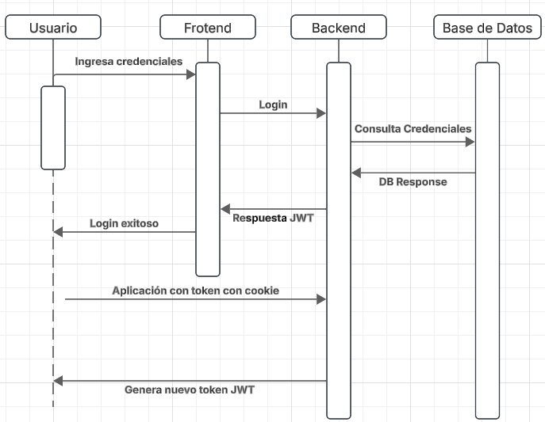

*Universidad de San Carlos de Guatemala*  
*Escuela de Ingeniería en Ciencias y Sistemas, Facultad de Ingenieria*  
*Laboratorio Software Avanzado 1 - A, Primer Semestre 2025.*  
*Nombre: Andy Ezequiel Sanic Tiul - 202006699*  

# Practica #2


# Instrucciones de ejecución 
 ```
  git clone https://github.com/AndyST70/Practicas-SA-A-202006699.git
  ```

## Instalar dependencias
Backend
  ```
    pip install jwt
    pip install Flask
    pip install mysql-connector-python

  ```
Frontend
  ```
  npm install
  npm run dev
  ```


  Accedemos a la siguiente dirección :
  http://localhost:3000/login

  # Tecnologías y Herramientas Utilizadas

### Backend
Se utilizo Python con Flask
#### Ventajas
* Desarrollo rápido y escalable.
* Amplia comunidad de soporte.
* Integración sencilla con bases de datos relacionales.
#### Desventajas
* Posible menor rendimiento en ciertas cargas muy altas (según la implementación).

### Fronted
Se utilizo React para el manejo del frontend, así como uso de Material UI + Nex js
#### Ventajas
* Interfaces dinámicas y reactivas.
* Gran ecosistema de bibliotecas y componentes.
#### Desventajas
* Curva de aprendizaje en conceptos avanzados (como hooks o manejo de estados complejos).

### Base de datos
Se utilizo MySQL, para el manejo de las DB.

#### Ventajas
* Buen manejo de datos estructurados.
* Alta confiabilidad y escalabilidad en proyectos empresariales.
#### Desventajas
* Menor flexibilidad en el manejo de datos no estructurados en comparación con bases NoSQL.


# Cookies HTTP/HTTPS y Algoritmo AES

## Cookies HTTP/HTTPS Only:
Las cookies configuradas como HTTP/HTTPS only solo pueden ser enviadas al servidor a través de peticiones HTTP o HTTPS, impidiendo su acceso mediante scripts del lado del cliente. Esto mejora la seguridad contra ataques como Cross-Site Scripting (XSS).

## Algoritmo AES (Advanced Encryption Standard):
Es un algoritmo de cifrado simétrico utilizado para proteger información sensible. Se caracteriza por su eficiencia y alta seguridad, siendo ampliamente adoptado para encriptar datos confidenciales en aplicaciones modernas.

# JWT 

Un JWT es un token que contiene información sobre la identidad de un usuario y la autorización para acceder a recursos específicos. Se compone de tres partes:

* Encabezado (Header): Especifica el tipo de token, el algoritmo de firma y otra información relevante.

* Carga útil (Payload): Contiene los datos sobre el usuario, como la identificación, nombre, roles y fecha de expiración del token.

* Firma: Garantiza la integridad y autenticidad del token mediante una firma digital utilizando un algoritmo criptográfico y una clave secreta compartida entre el servidor y el cliente.


# Diagrama
