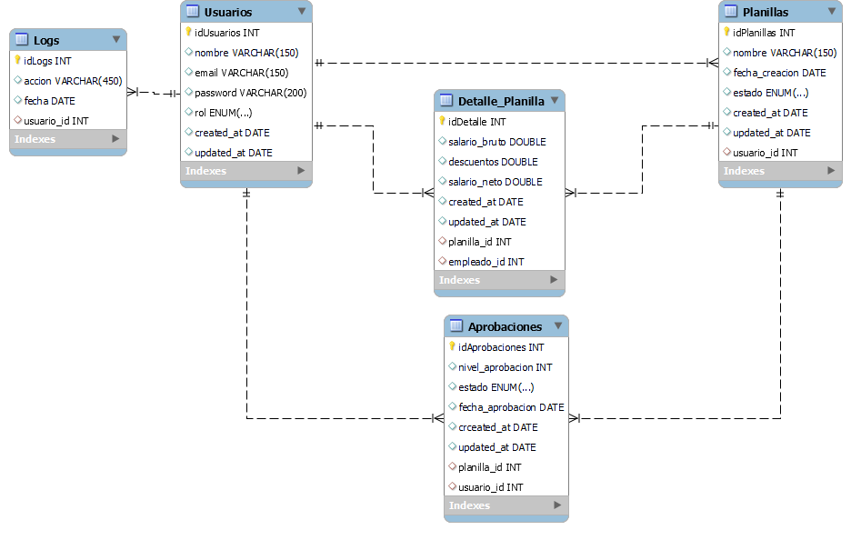

*Universidad de San Carlos de Guatemala*  
*Escuela de Ingeniería en Ciencias y Sistemas, Facultad de Ingenieria*  
*Laboratorio Software Avanzado 1 - A, Primer Semestre 2025.*  
*Nombre: Andy Ezequiel Sanic Tiul - 202006699*  

# Practica #3

# Base de Datos 
El modelo de base de datos se diseñó para almacenar de forma estructurada la información de los usuarios, planillas, aprobaciones, logs y detalles de pago. Se utiliza una base de datos relacional (MySQL o PostgreSQL) debido a la naturaleza estructurada y relacional del sistema, permitiendo consultas eficientes y asegurando la integridad de los datos con claves foráneas y restricciones.

- Consistencia de datos: Garantiza que las relaciones entre usuarios, planillas y aprobaciones sean válidas.
- Escalabilidad: Soporta un alto volumen de transacciones sin comprometer el rendimiento.
- Seguridad: Manejo de roles y permisos a nivel de base de datos.

# Arquitectura de Capas
Se adoptó un modelo de arquitectura en capas para mejorar la separación de responsabilidades y la mantenibilidad del sistema.

- Modularidad: Cada capa tiene su responsabilidad, facilitando el mantenimiento y escalabilidad.
- Seguridad: La capa de presentación interactúa solo con el API Gateway, evitando acceso directo a los servicios internos.
- Flexibilidad: Permite el uso de diferentes tecnologías en cada capa sin afectar a las demás.

## Capa Presentación : 

* Aplicacion Web
* Consumo de Api
## Capa Lógica
* Servicio usuarios : Gestión usuarios
* Servicio de planillas : Procesamiento de planillas
* Servicio de Aprobaciones : Flujo aprobacion en 3 pasos
* Servicio de notificaciones : Envio de correos 
* Servicio de logs: Registro y consulta de eventos.

## Capa Datos: 
* Base de datos Relacional

## Capa de Infraestructura
* Autenticacion Oauth
* MySQL

# Arquitectura de Microservicios
Se implementó una arquitectura basada en microservicios para mejorar el rendimiento, escalabilidad y disponibilidad del sistema, evitando los problemas de un sistema monolítico.
- scalabilidad independiente: Cada servicio puede crecer según la demanda.
- Resiliencia: Fallos en un microservicio no afectan a todo el sistema.
- Despliegue flexible: Se pueden actualizar servicios sin interrumpir el sistema completo.
- Manejo eficiente de eventos: Uso de Kafka para comunicación asíncrona entre servicios.

Componentes 

## API Gateway
- Punto de entrada único para los clientes.
- Control de acceso y seguridad.

## Servicio de Autenticación (OAuth2 + JWT)
- Maneja el inicio de sesión y autorización de usuarios.
- Almacena roles en DB Roles (MySQL).

## Servicio de Carga CSV
- Permite la subida y almacenamiento de archivos en AWS S3.
- Separa el procesamiento de archivos de la lógica del sistema.

## Servicio de Validación
- Verifica la estructura del archivo CSV y valida los datos.
- Almacena los datos en DB Historial (RDS).

## Servicio de Aprobación
- Implementa la lógica de aprobación en 3 pasos.
- Almacena las transacciones en DB Procesos (MySQL).

## Servicio de Notificaciones
- Envia correos a los empleados cuando una planilla es aprobada.
- Maneja eventos mediante Kafka.

## Servicio de Logs
- Registra eventos clave del sistema.
- Utiliza MongoDB para almacenamiento de logs estructurados.

## Integración con Sistemas Externos

Se requiere integración con un sistema financiero externo para procesar los pagos de los empleados. Para ello:
- Se establece comunicación mediante API REST.
- Se utiliza autenticación segura basada en OAuth2.
-Se registra cada transacción en el servicio de logs para auditoría.