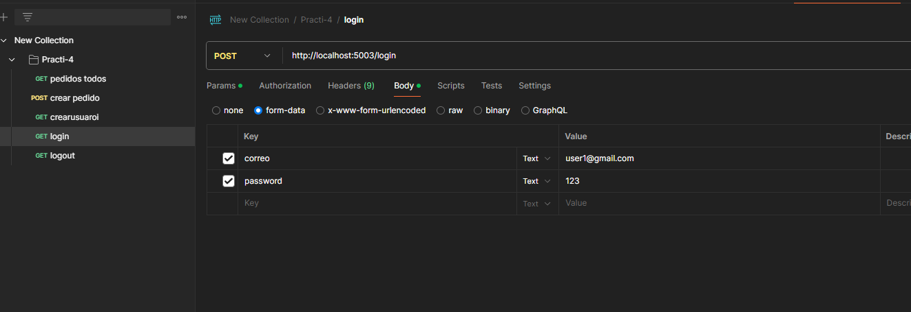
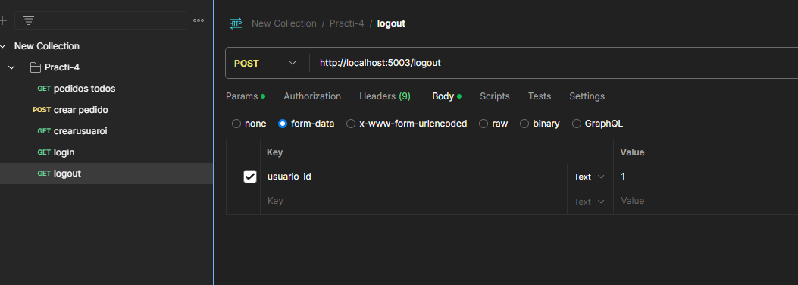
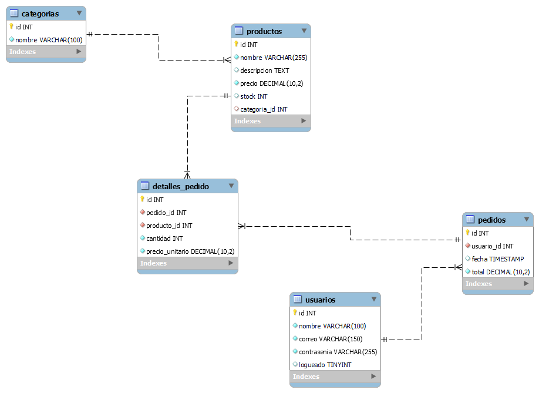

# Microservicios - Proyecto SA

Este proyecto contiene una arquitectura de microservicios desplegada con Docker Compose. Incluye servicios de catálogo, usuarios, pedidos y registro.

## Microservicios

- **catalogo-ms**: Gestión de productos y categorías (GraphQL)
- **registro-ms**: Registro y autenticación de usuarios (GraphQL)
- **usuario-ms**: Creación, login, logout (REST)
- **pedido-ms**: Gestión de pedidos y detalles (REST)
- **mysql**: Base de datos relacional


## Contratos de Microservicios

> Estructura esperada de solicitudes y respuestas por servicio
### login

### crear usuario

### crear pedido

### logout

### todos los pedidos


### `catalogo-ms` (GraphQL)
```graphql
query {
  productos {
    id
    nombre
    precio
  }
}
```

usuario-ms (REST)
POST /crear_usuario
```
{
  "nombre": "Juan",
  "correo": "juan@mail.com",
  "password": "123456"
}
```
pedido-ms (REST)
POST /realizar_pedidos

{
  "usuario_id": 1,
  "producto_id": 2,
  "cantidad": 3
}

Comandos

```
docker compose up --build
```
Variables de entorno 
```
DB_HOST=mysql
DB_USER=root
DB_PASS=123456789
DB_NAME=catalogo_db
```

microservicios/registro-ms/docker/Dockerfile
```
FROM node:18

WORKDIR /app

COPY package.json package-lock.json ./
RUN npm install

COPY . .
COPY wait-for-it.sh .
RUN chmod +x wait-for-it.sh

CMD ["./wait-for-it.sh", "mysql:3306", "--timeout=30", "--", "node", "server.js"]

EXPOSE 4001

```

microservicios/usuario-ms/Dockerfile
```
FROM python:3.10
WORKDIR /app
COPY requirements.txt .
RUN pip install --no-cache-dir -r requirements.txt
COPY . .
CMD ["python", "main.py"]
EXPOSE 5003

```

microservicios/pedido-ms/Dockerfile
```
FROM python:3.10
WORKDIR /app
COPY requirements.txt .
RUN pip install --no-cache-dir -r requirements.txt
COPY . .
CMD ["python", "main.py"]
EXPOSE 5002

```
microservicios/catalogo-ms/docker/Dockerfile`
```
FROM node:18

WORKDIR /app

COPY package.json package-lock.json ./
RUN npm install

COPY . .
COPY wait-for-it.sh .
RUN chmod +x wait-for-it.sh

CMD ["./wait-for-it.sh", "mysql:3306", "--timeout=30", "--", "node", "server.js"]

EXPOSE 4000


```
Archivo YAML (docker-compose.yml)
```
version: "3.8"

services:
  mysql:
    image: mysql:8
    restart: always
    environment:
      MYSQL_ROOT_PASSWORD: 123456789
      MYSQL_DATABASE: catalogo_db
    ports:
      - "3306:3306"
    volumes:
      - ./db/init.sql:/docker-entrypoint-initdb.d/init.sql

  catalogo-ms:
    build: 
      context: ./microservicios/catalogo-ms
      dockerfile: docker/Dockerfile       
    ports:
      - "4000:4000"
    depends_on:
      - mysql

  registro-ms:
    build: 
      context: ./microservicios/registro-ms
      dockerfile: docker/Dockerfile
    ports:
      - "4001:4001"
    depends_on:
      - mysql

  usuario-ms:
    build: ./microservicios/usuario-ms
    ports:
      - "5003:5003"
    depends_on:
      - mysql

  pedido-ms:
    build: ./microservicios/pedido-ms
    ports:
      - "5002:5002"
    depends_on:
      - mysql

```

Tablas:

* usuarios : se guardaran los usuarios
* productos : se guardaran los productos
* categorias : se guardaran categorias
* pedidos : se guardara pedidos
* detalles_pedido : se guardaran los pedidos realizados por usuarios




